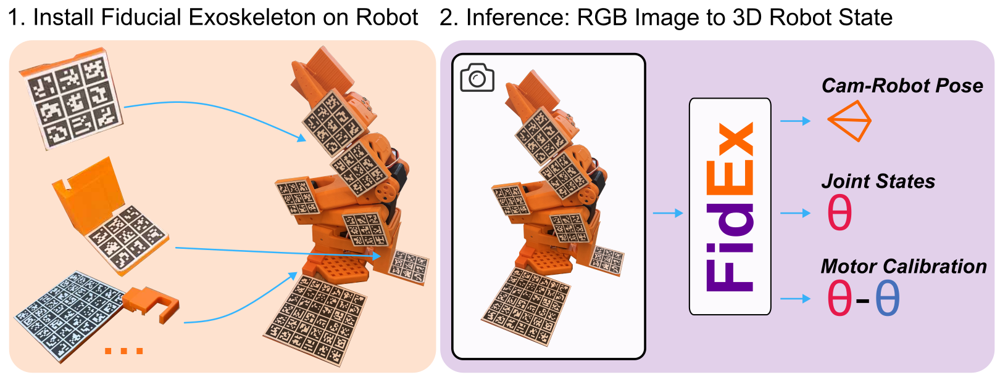
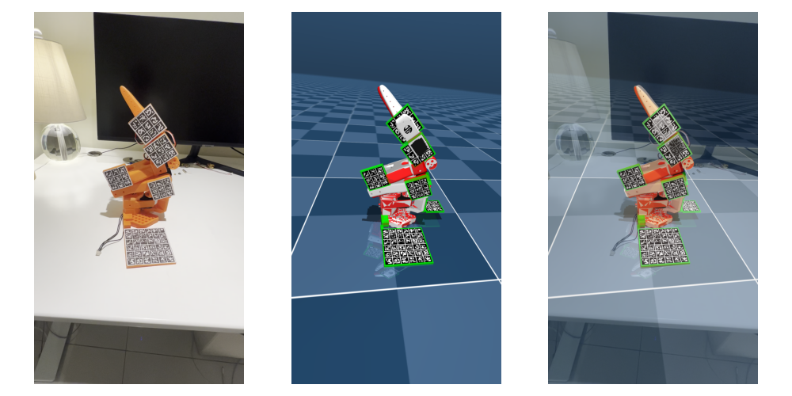

Official implementation of `Fiducial Exoskeletons: Image-Centric Robot State Estimation`  
[[Project page](https://cameronosmith.github.io/fidex)], [[arxiv](https://arxiv.org)]  

## Sample Camera and Joint Angles Inference (uncalibrated RGB camera)


## Usage (demo.py code)
 
```python
import mujoco, matplotlib.pyplot as plt, numpy as np
from exo_utils import estimate_robot_state, detect_and_set_link_poses, position_exoskeleton_meshes, render_from_camera_pose, get_link_poses_from_robot
from exo_configs import SO100_ADHESIVE_CONFIG

robot_config = SO100_ADHESIVE_CONFIG
# Load model from config
model = mujoco.MjModel.from_xml_string(robot_config.xml)
data = mujoco.MjData(model)

# Set virtual robot state from image, run with normal python
rgb = plt.imread('assets/tabletop_so100.png')[..., :3]
if rgb.max() <= 1.0: rgb = (rgb * 255).astype(np.uint8)

# Detect link poses from ArUco markers
link_poses, camera_pose_world, cam_K, corners_cache,corners_vis,obj_img_pts = detect_and_set_link_poses(rgb, model, data, robot_config)
configuration = estimate_robot_state( model, data, robot_config, link_poses, ik_iterations=55)
data.qpos[:] = data.ctrl[:] =configuration.q
position_exoskeleton_meshes(robot_config, model, data, link_poses)
mujoco.mj_forward(model, data)

# Render from estimated camera pose and show on top of image
rendered = render_from_camera_pose(model, data, camera_pose_world, cam_K, *rgb.shape[:2])
fig, axes = plt.subplots(1, 3, figsize=(10, 5))
for ax, img in zip(axes, [rgb, rendered, (rgb * 0.5 + rendered * 0.5).astype(np.uint8)]): ax.imshow(img);ax.axis('off')
plt.tight_layout()
plt.show()
```

## Project Structure
`demo.py` estimates the camera and joint angles from an uncalibrated RGB image of the robot. Use `--just_sim_state` with `mjpython` flag to just view the exoskeleton in the mujoco viewer.

`exo_utils.py` contains helper functions for the exoskeleton estimation.

`exo_configs` contains the mujoco xml files for the exoskeletons.